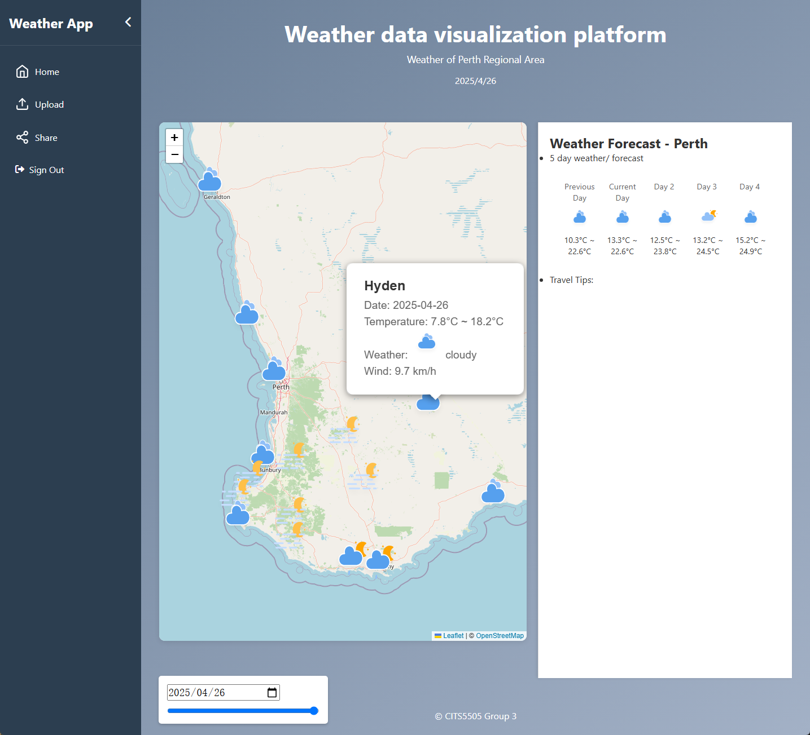

# 🌦️ Perth Regional Weather Map 🌏

This website helps users make travel plans by visualizing weather in regional areas. 🌤️ Users can import weather data from the Internet or upload CSV files to easily find places with appealing weather. 🌈 Weather updates can also be shared with friends registered on the website, who will receive them in their share message center. 📩

---

## 👥 Contributors:

| Name                     | Student ID | GitHub Profile                                   |
|--------------------------|------------|-------------------------------------------------|
| **Canaan Guo**           | 24576325   | [GitHub: bilibilistack](https://github.com/bilibilistack) |
| **Changjiang Zhang**     | 24176913   | [GitHub: chanale](https://github.com/chanale)   |
| **Marcus Zhou**          | 24257061   | [GitHub: MarcusZhou-2024](https://github.com/MarcusZhou-2024) |
| **Wendy Song**           | 24563207   | [GitHub: WendySong1](https://github.com/WendySong1) |

---

## 📂 Project Structure

```
CITS5505Group3/
├── app/                            # Main application folder
│   ├── __init__.py                 # Initializes the Flask app, database, and CSRF protection
│   ├── config.py                   # Configuration file for the Flask app (e.g., database settings)
│   ├── routes.py                   # Defines the main routes for the application
│   ├── models.py                   # Contains database models (e.g., User model)
│   ├── auth_routes.py              # Handles authentication-related routes (e.g., login, logout)
│   ├── api_routes.py               # Handles API routes 
│   ├── share_routes.py             # Handles share page-related routes 
│   ├── upload_routes.py            # Handles upload page-related routes 
│   ├── GetWeather.py               # Scripts to fetch data from OpenWeather API
│   ├── templates/                  # HTML templates for rendering views
│   │   ├── base.html               # Base template with shared layout (header, sidebar, footer)
│   │   ├── homechart.html          # Template for the weather visualization page
│   │   ├── upload.html             # Template for the file upload page
│   │   ├── intro.html              # Template for the introduction page before login
│   │   ├── share.html              # Template for the sharing page
│   │   ├── login.html              # Template for the login page
│   │   ├── register.html           # Template for the register page
│   │   ├── redirect.html           # Template for the redirect page
│   ├── static/                     # Static files (CSS, JavaScript, images)
│   │   ├── chart/                  # Static files for the weather visualization page
│   │   │   ├── resources/          # Icon library and csv/json backups
│   │   │   ├── homechart.css       # Styles for the weather visualization page
│   │   │   ├── homechart.js        # JavaScript for the weather visualization page
│   │   │   ├── leaflet.css         # Leaflet library styles for maps
│   │   │   ├── leaflet.js          # Leaflet library JavaScript for maps
│   │   │   ├── base.css            # Shared styles for the entire application
│   │   ├── login/                  # Static files for the login page
│   │   │   ├── login.css           # Styles for the login page
│   │   │   ├── home.js             # JavaScript for login and registration
│   │   │   ├── intro.css           # Styles for the intro page
│   │   │   ├── register.css        # Styles for the registration page
│   │   │   ├── main.css            # Styles for the login and registration page
│   │   ├── share/                  # Static files for the share page
│   │   │   ├── share.css           # Styles for the share page
│   │   │   ├── share.js            # JavaScript for handling share
│   │   ├── upload/                 # Static files for the file upload page
│   │   │   ├── upload.css          # Styles for the file upload page
│   │   │   ├── upload.js           # JavaScript for handling file uploads
│   ├── instance/                   # Folder for SQLite database and instance-specific files
│       ├── application.db          # SQLite database file, will be generated but excluded from git
├── demo/                           # Demo folder for testing or showcasing the app
│   ├── app.py                      # Entry point for running the demo application
│   ├── README.md                   # Instructions for running the demo
├── README.md                       # Project overview and instructions for running the application
├── load_demo_data.py               # Clean database and load demo user, city, and weather data
├── start_server.py                 # Start server using python start_server.py
├── .gitignore                      # Specifies files and folders to ignore in version control
```

---

## 🚀 Instructions for Launching the Application

1. Install **Python 3.13** 🐍.
2. Create and activate your Python environment (optional):  
    ```
    python -m venv application-env
    cd application-env/Scripts
    activate.bat (cmd) or activate.ps1 (PowerShell) or activate (bash)
    ```
3. Install required modules:  
    ```
    pip install -r requirements.txt
    ```
4. For the first time, run in the codebase root directory:  
    ```
    flask db upgrade
    ```

5. Add SECRET_KEY to ENV (Please replace with your own key string!):

    Linux: 
    ```
    export SECRET_KEY='YOUROWNKEY'
    ```
    CMD: 
    ```
    set SECRET_KEY=YOUROWNKEY
    ```
    Powershell: 
    ```
    $env:SECRET_KEY = "YOUROWNKEY"
    ```

6.  load demo data, run:  
    ```
    python load_demo_data.py
    ```
7.  Start the server:  
    ```
    python start_server.py
    ```


Once the server is running, open your browser and visit:  
👉 [http://127.0.0.1:5000](http://127.0.0.1:5000)

---

## 🧪 Instructions for Running Tests

To run tests for the website:

### Unit Tests:
```bash
python -m unittest test.unitTests
```

### System Tests:
```bash
python -m unittest test.systemTests
```

---

## 🛑 Stop the Server

Press **CTRL+C** to quit.

## ❓ Frequently Asked Questions:

1. **Why can't I see any weather marks on the homechart page?**  
    Ensure you have loaded the demo data, which includes the city list and location information in the database, and restart the server. The weather fetch API only updates the weather and does not modify the predefined city list.

2. **Why does the webpage show "RuntimeError: A secret key is required to use CSRF"?**  
    Follow step 5 in the instructions to add a secret key to the environment.
---
## 🌐 Website Preview



---
## 📚 References

- Weather data is fetched using the [Open-Meteo API](https://open-meteo.com/). Special thanks to Open-Meteo for providing this service.
- Map visualizations in this project are powered by [Leaflet.js](https://leafletjs.com/). We appreciate their excellent library.
- Portions of the code and tests were developed with the assistance of generative AI tools, including Microsoft Copilot and ChatGPT 4.0.


