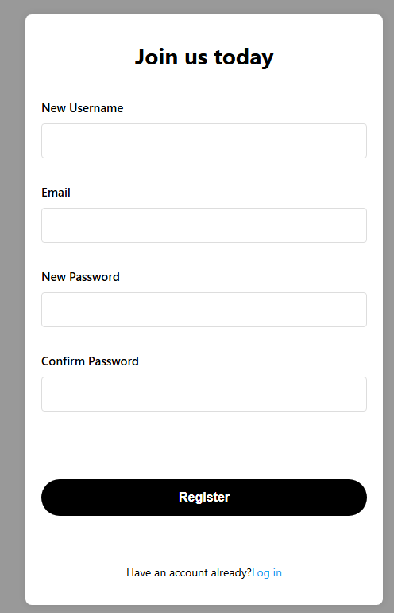

# Perth Regional Weather Map 
This website aims to help people make travel plans by providing visualization of weather in reginal areas. Users could import weather data and easily find places with appealing weathers.


## Contributor:
- 24576325 Canaan Guo github:bilibilistack
- 24176913 Changjiang Zhang  github:chanale
- 24257061 Marcus Zhou github:MarcusZhou-2024
- 24563207 Wendy Song github:WendySong1

## Project Structure

```
CITS5505Group3/
├── app/                            # Main application folder
│   ├── __init__.py                 # Initializes the Flask app, database, and CSRF protection
│   ├── routes.py                   # Defines the main routes for the application
│   ├── models.py                   # Contains database models (e.g., User model)
│   ├── auth_routes.py              # Handles authentication-related routes (e.g., login, logout)
│   ├── templates/                  # HTML templates for rendering views
│   │   ├── base.html               # Base template with shared layout (header, sidebar, footer)
│   │   ├── homechart.html          # Template for the weather visualization page
│   │   ├── upload.html             # Template for the file upload page
│   │   ├── intro.html              # Template for the introduction page
│   │   ├── share.html              # Template for the sharing page
│   ├── static/                     # Static files (CSS, JavaScript, images)
│   │   ├── chart/                  # Static files for the weather visualization page
│   │   │   ├── homechart.css       # Styles for the weather visualization page
│   │   │   ├── homechart.js        # JavaScript for the weather visualization page
│   │   │   ├── leaflet.css         # Leaflet library styles for maps
│   │   │   ├── leaflet.js          # Leaflet library JavaScript for maps
│   │   ├── upload/                 # Static files for the file upload page
│   │   │   ├── upload.css          # Styles for the file upload page
│   │   │   ├── upload.js           # JavaScript for handling file uploads
│   │   ├── base.css                # Shared styles for the entire application
│   ├── config.py                   # Configuration file for the Flask app (e.g., database settings)
│   ├── instance/                   # Folder for SQLite database and instance-specific files
│       ├── application.db          # SQLite database file
├── demo/                           # Demo folder for testing or showcasing the app
│   ├── app.py                      # Entry point for running the demo application
│   ├── README.md                   # Instructions for running the demo
├── README.md                       # Project overview and instructions for running the application
├── .gitignore                      # Specifies files and folders to ignore in version control
```


## instructions for how to launch the application

If you haven’t installed the required packages(`flask` and `flask_sqlalchemy`) yet, run the following command:

```
pip install alembic==1.15.2 blinker==1.9.0 click==8.1.8 colorama==0.4.6 Flask==3.1.0 Flask-Migrate==4.1.0 Flask-SQLAlchemy==3.1.1 Flask-WTF==1.2.2 greenlet==3.2.1 itsdangerous==2.2.0 Jinja2==3.1.6 Mako==1.3.10 MarkupSafe==3.0.2 SQLAlchemy==2.0.40 typing_extensions==4.13.2 Werkzeug==3.1.3 WTForms==3.2.1

```

In your project root directory, run:

```
python app.py
```

Once the server is running, open your browser and visit:

http://127.0.0.1:5000


Press CTRL+C to quit





##TODO:
instructions for how to run the tests for the application.

