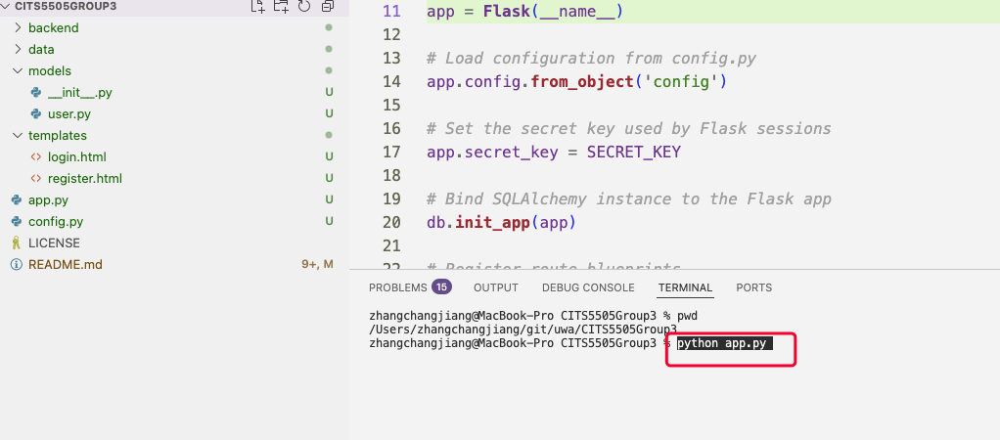
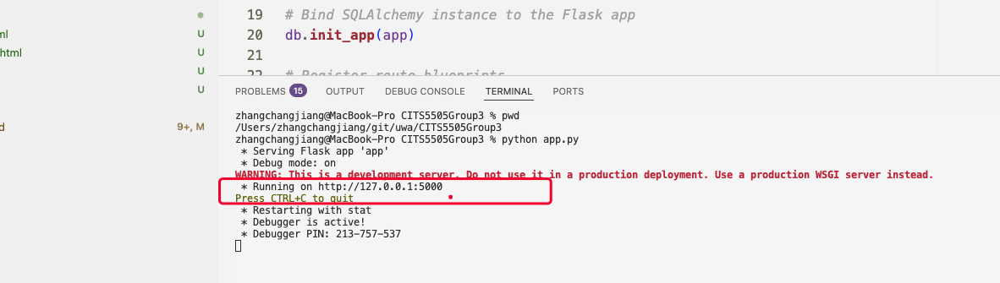
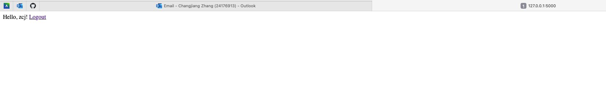
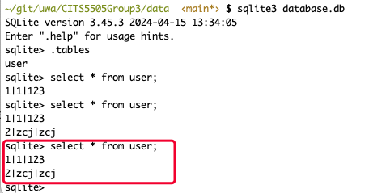

# Perth Regional Weather Map 
This website aims to help people make travel plans by providing visualization of weather in reginal areas. Users could import weather data and easily find places with appealing weathers.


## Contributor:
- 24576325 Canaan Guo github:bilibilistack
- 24176913 Changjiang Zhang  github:chanale
- 24257061 Marcus Zhou github:MarcusZhou-2024
- 24563207 Wendy Song

## instructions for how to launch the application

If you haven’t installed the required packages(`flask` and `flask_sqlalchemy`) yet, run the following command:

```
pip install flask flask_sqlalchemy
```

In your project root directory, run:

```
python app.py
```



Once the server is running, open your browser and visit:

http://127.0.0.1:5000








Press CTRL+C to quit


##TODO:
instructions for how to run the tests for the application.

